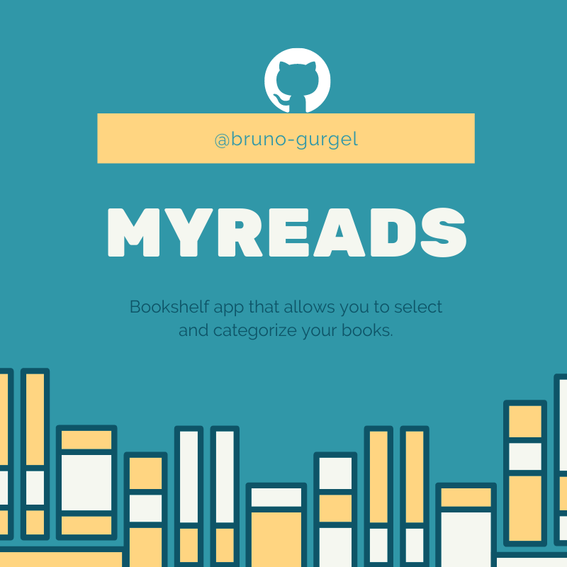
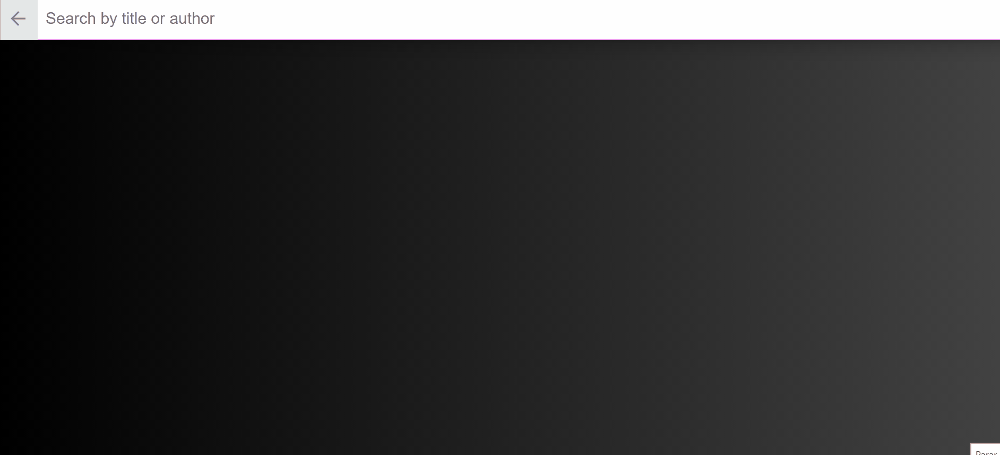

# MyReads App

This project was made during [Udacity's React Nanodegree](https://www.udacity.com/course/react-nanodegree--nd019) and it is a bookshelf app that allows you to select and categorize books you have read, are currently reading, or want to read.

### There is also a Search feature so you can add books to your bookshelfs.

## React is the focus

Since it is a project focused on react, it was not the goal to build an app focused on style and backend programming. So Udacity gave an starter code with basic styling and a backend server.

You can find information about the backend server (src/BooksAPI.js) and the starter code [here](https://github.com/udacity/reactnd-project-myreads-starter).

## Starting the App

- Install al the project dependencies with `npm install`;
- Start the development server with `npm start`.

**Obs: Since this app was created with the newly released npm version 7, it creates a package-lock.json version 2, that may cause some problems if you don't have this npm version. In this case you should install and start the app with `yarn install` and `yarn start`. [Here are the instructions to install yarn](https://yarnpkg.com/getting-started/install)**

### Contributions

Any contributtions and/or suggestions are greatly appreciated.

### License

[MIT License](https://opensource.org/licenses/MIT).
